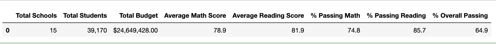
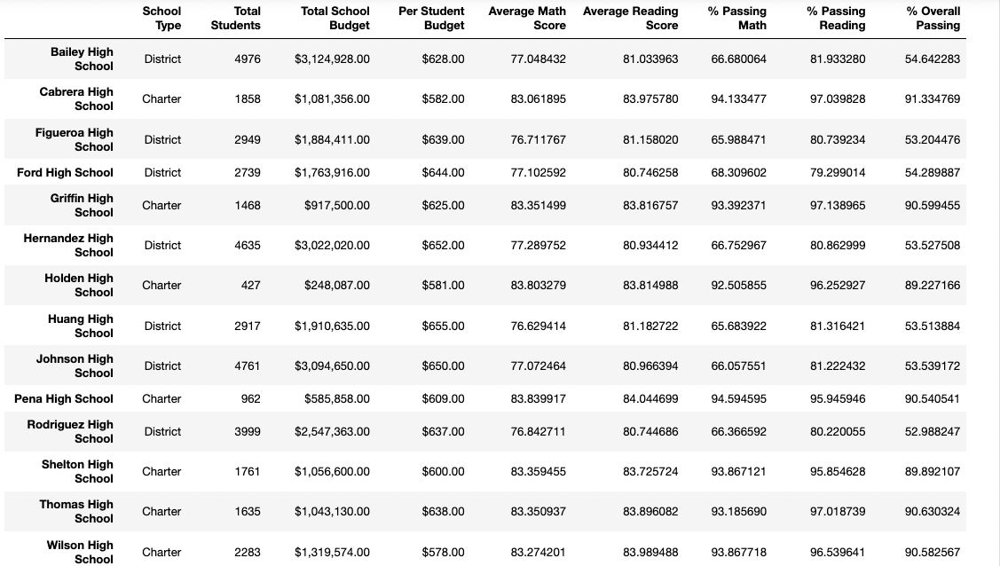
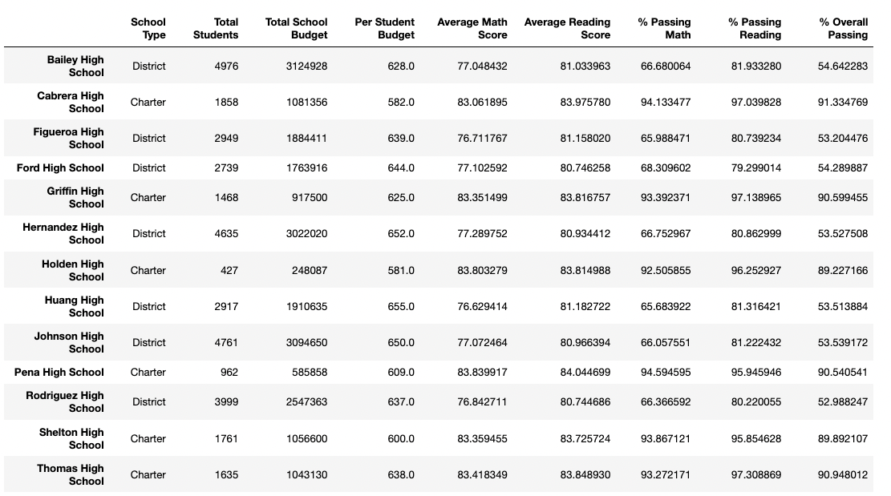
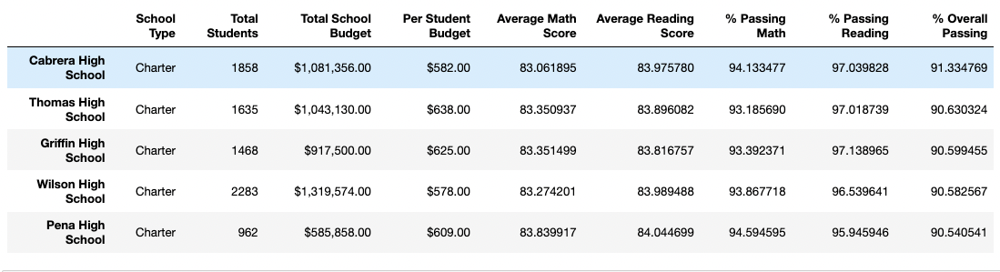
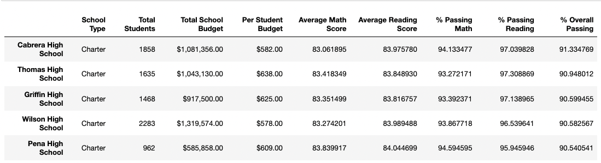

# School District Analysis

## Overview of the school district analysis 
The purpose of the below analysis is to perform an overview of the 15 high schools in math and reading subjects by excluding the results of the math and reading scores for Thomas High Schools 9th graders due to the academic dishonesty. In our analysis below, we compared that the exclusion of  these grades would have impact on the overall performance results.

## Results
Based on our analysis we noted the following: 
* Per district summaries below, we can see that the updated overall performance for math and reading scores without the Thomas High Schools results are slightly lower than the original results. 

District Summary Updated

 

District Summary Original

*	In relation to the Thomas school summary performance, we can see that the results are also insignificantly changed. Overall passing % decreased from 90.95% to 90.63% as shown below.

School Summary Updated

School Summary Original

 
*	Even with replaced 9th graders results, Thomas High School is still a top second school in the rating, as shown below. 

Top schools listing Updated

 
Top schools listing Original

 
## Summary

Based on our analysis above, we concluded that the replacement of the Thomas High School 9th graders does not significantly impact the overall performance of the school. Thomas High School is still a top second performed among other 14 schools. 

